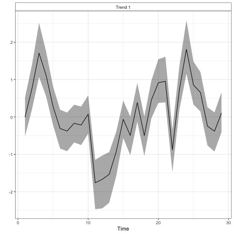
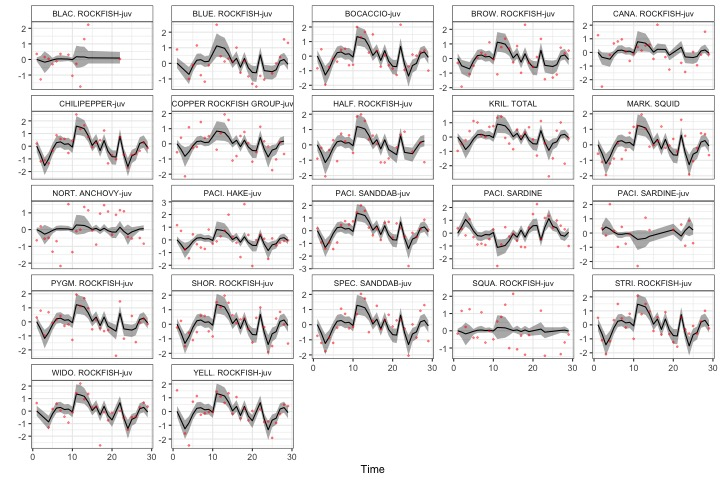

<!-- README.md is generated from README.Rmd. Please edit that file -->

<!-- badges: start -->

  

<!-- badges: end -->

## Overview

This repository is a demonstration of automatic index generation using
data from RREAS and ERDDAP. The index is generated by applying Dynamic
Factor Analysis (DFA) to the top \~ 20+ species, using samples collected
1990 - present.

## Results

For illustrative purposes we’re only showing the model with 1-trend.

Estimated trends for the RREAS community

Estimated loadings for the RREAS community

Predicted and observed fits to the RREAS data

## bayesdfa

For more on the approach used, check out the [bayesdfa R
package](https://fate-ewi.github.io/bayesdfa/)
